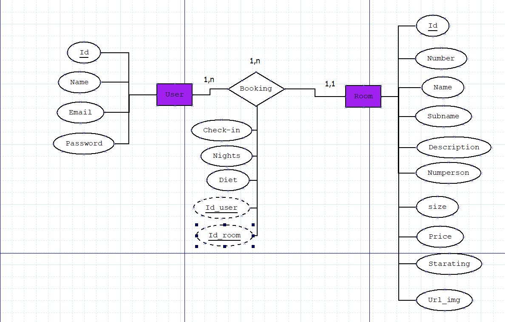
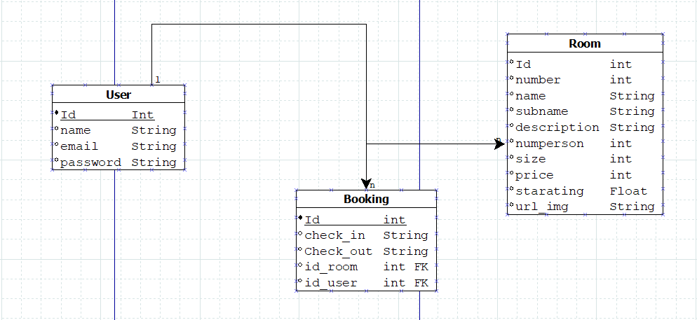
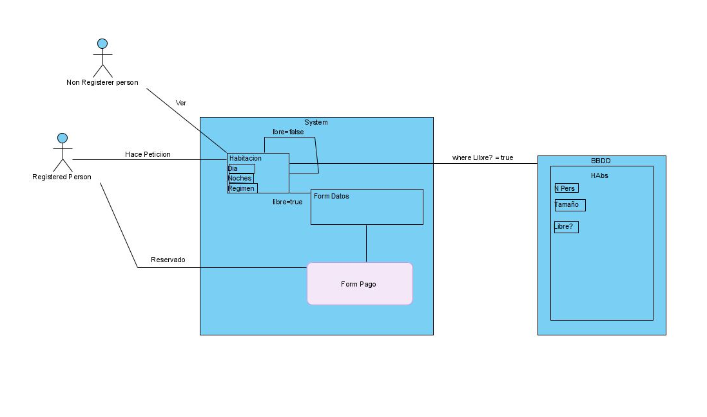
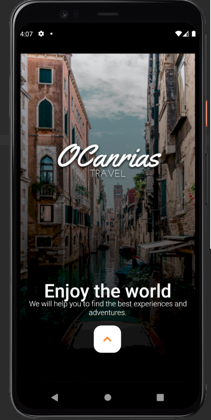
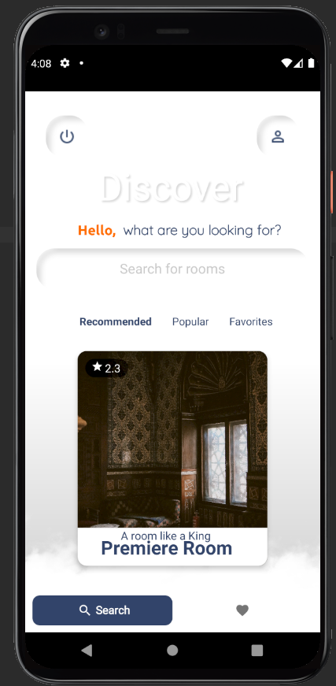
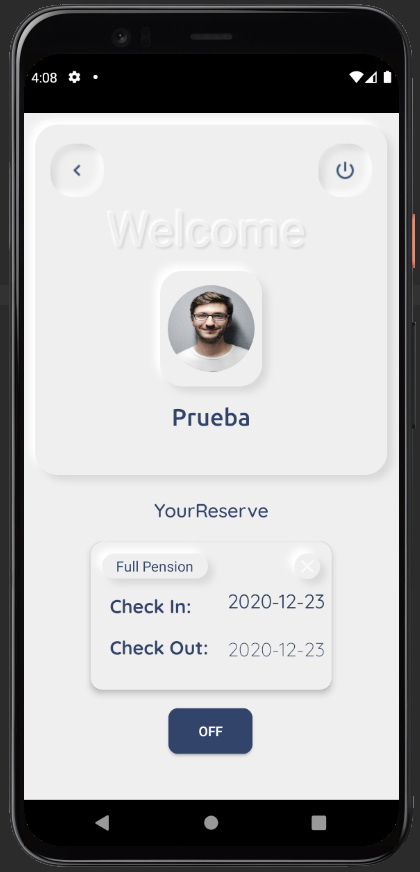
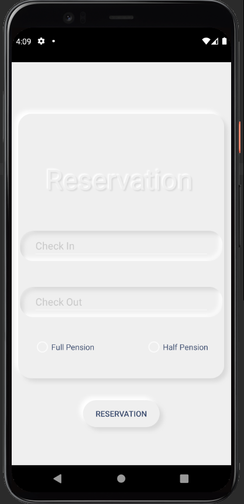
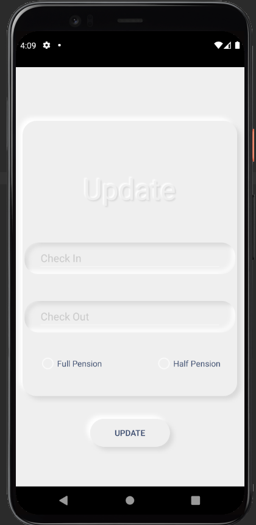

# Enlaza Proyect - Open Canarias
This project has been developed for the Open Canarias company, as it is already summarized in the name itself, the summarized idea of ​​the application is that a anyone can make a reservation for a hotel room.

 ## Table of Contents
1. [Pre Requisites](#pre-requisites)
2. [Data model](#data-model)
3. [Entity Relationship](#entity-relationship)
4. [Model Relationship](#model-relationship)
5. [User requirements](#user-requirements)
6. [Use cases](#use-cases)
7. [Enlaza Project Prototype](#enlaza-project-prototype)
8. [Technology Stack](#technology-stack)
9. [Repositories](#repositories)
10. [Planification](#planification)
11. [Conclusions and opinions](#conclusions-and-opinions)

## Pre Requisites
### First Steps 📋
When you download or clone this repository, the first thing you should do is run the following command in the direction of the project
```
composer install
```
### Migrations ⚙️
Then you must take into account the configuration of the DB in the .env file. Then you should create a migration with the following command:
```
php artisan migrate
```
You should also take into account other existing commands if you modify or eliminate something from the migrations:
```
php artisan migrate:rollback
php artisan migrate
```
And you are ready to start the Android app, but first you should be sure to open your command console and type the following command
```
ipconfig
```
Once you are clear about what IP your computer is using, you should go to the terminal and go to the backend folder, and then execute the following

```
php -S (YOUR_IP):8000 -t public
```
Now you should go to the IRetroFit file and ServiceSingleton to modify the ip previously established by me to yours

## Data model
The data model follows the following description or structure:
* **Users Table:** This table will be where we find the data to predispose to make the record.
  * **Name:** User name
  * **Email** User Email
  * **Password** User Password
  
* **Rooms Table:** This table will be where we find the data that the users of the rooms see.
  * **Number:** Room number
  * **Name:** Room name
  * **Subname:** Room number
  * **Description:** Room description
  * **Numperson:** Number of people who can occupy the room
  * **Size:** Room size
  * **Price:** Room price
  * **Starating:** Number of evaluations
  * **Url_img:** Room image
  
* **Bookings Table:** This table will be where we will find the data that you will have to give to develop the reservation.
  * **Check_in:** Check in
  * **Check_out** Check out
  * **Diet** Booking plan type
  * **id_user** Id User Reservation (FK user table)
  * **id_room** Id of the reserved room (FK room table)
  
## Entity Relationship


## Model Relationship


## User requirements
The user requirements can be defined as follows:
* The user must be able to register through basic authentication, in addition, to be able to Login.
* The user can view the available rooms.
* The user must be able to make reservations, once they are made, they should be able to view them, and then be able to delete or update them.

## Use cases


## Explanation of the Application
The application follows the architecture of the prototype provided as far as possible. That is, what is composed of the screens themselves:

* **Start Window:** In this window we can find a simple starting window of any application



* **Login or registration form:** In this window you will have to register, or in case you already have an account, simply enter your identifying information and enter.

* **Discover window:** In this window you must select between the different destinations to select.



* **User window:** In this window you will see data such as the name of the user and the reservations generated by the same.



* **Detail Room window:** You will see the specific room, in which you had played the last time.


* **Reserve or Update Reserve windows:** In these windows you will see a form where you can carry out the specific actions of each of the windows.



## Enlaza Project Prototype

I describe this section in its corresponding repository, https://github.com/JavierMedina11/Prototipo-ProyectoEnlaza

## User manual
[Manual Español](https://github.com/JavierMedina11/OpenCanarias_EnlazaProject/blob/main/doc/Documentacion%20Eng.pdf)
[English Manual](https://github.com/JavierMedina11/OpenCanarias_EnlazaProject/blob/main/doc/Documentacion%20Esp.pdf)

## Technology Stack
The technology stack is divided into the following technologies:

* **Backend:** PHP 7 / Laravel Framework
* **Microservicio:** Lumen Framework
* **BBDD:** MySQL
* **Frontend:** Android Kotlin


## Technology Comparison
As for the technology comparison, I would like to get to the point and compare the programming in native or hybrid App's, since they are the ones I have had the pleasure of working with. As for these two, I would like to emphasize that both have their advantages and disadvantages.

Even so, I will try to expose it much more clearly:
* **Time-to-market of the initial development / add and adjust a new functionality:** In the case of hybrid applications it is not necessary to maintain two different technologies and two different base codes, so with the same resources we can produce new features faster.
* **User experience:** While it is true that with current technologies, it is possible to create a user experience very similar to a native one, in some old terminals, the performance and therefore the user experience may be somewhat lower, therefore it is common for the application to flow better when it is 100% native.
* **Simplicity / Reuse of code:** The code of a hybrid application is portable to other platforms with minimal complexity, as long as they have support for said applications (Android Auto, Android Tv, etc). In addition, the existence of a single code for the base application, despite the fact that there may be specific customizations for each platform, gives a clear advantage to the hybrid application.
* **Look & Feel of the application:** It was always easier since the compatibility with CSS, which hybrid applications have, gives it a clear advantage in this regard, it should be noted that the native ones have a large number of libraries with which to get this "Look & Feel".
* **Development cost:** In native applications, by having to generate a different code for each platform, development costs grow in proportion to the number of platforms on which the developed application will be available.

In conclusion, for me there are two key elements that we identify in almost all the projects we face: time and money. In the case of hybrid applications, both the time-to-market (initial and evolutionary) and the costs are lower, therefore it is presented as a very good option for the development of App's that do not make use of elements such as 3D graphics , super-intensive use of CPU or have a direct link with hardware elements such as thermal cameras, NFC readers, etc.


## Repositories

The repositories we find this same one and that of https://github.com/JavierMedina11/Prototerapia-ProyectoEnlaza

## Planification

The planning of the app, I have had to do it on the fly, that is, since I obtained the information from the company with such a delay, I have had to make an effort to try to do everything in a period of three or three and a half weeks.

## Conclusions and opinions

My final conclusion regarding the project is that it has not been easy, since when working with a technological stack in which I had no experience, especially, not so much the backend (Laravel & Lumen), but Android Studio based on Kotlin which is the one that made up the Frontend, it has not been a mild experience, especially when we get to the delivery date and in which the pressure increases even more, although, I would like to highlight that based on blows and despair, my Confidence in my abilities may have improved a bit, although, due to the short period of time at work, I have not been able to implement everything that I would like, which leaves me with a small feeling of discomfort and unease.


