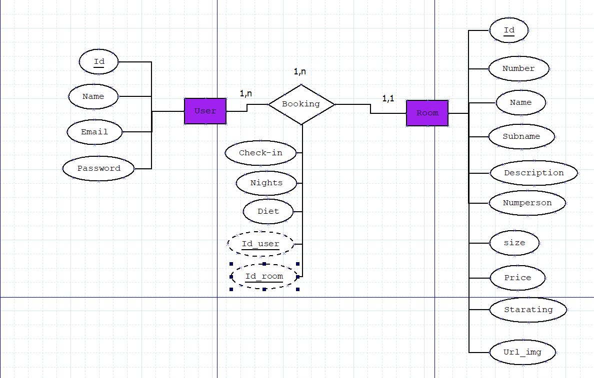
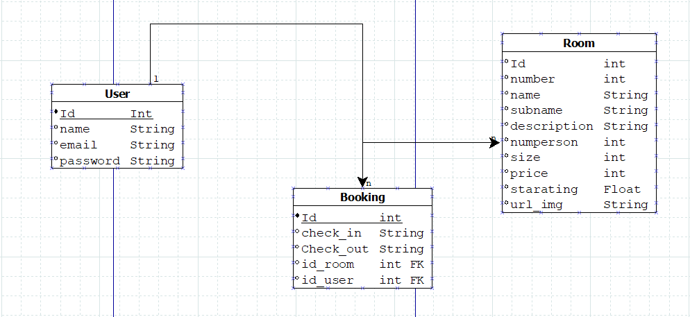
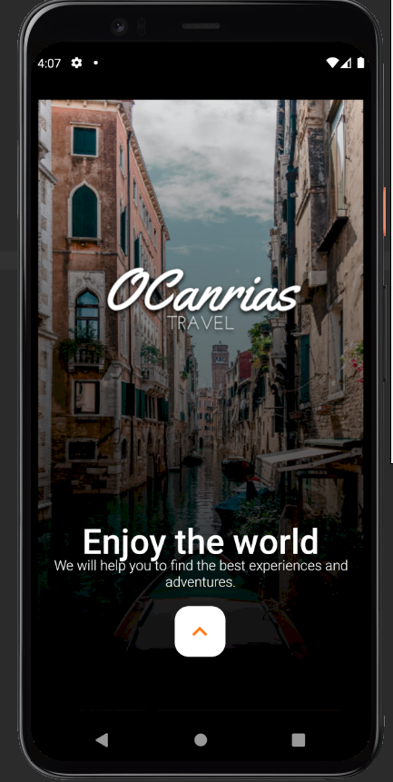
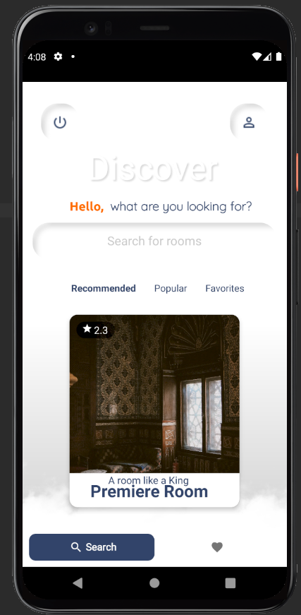
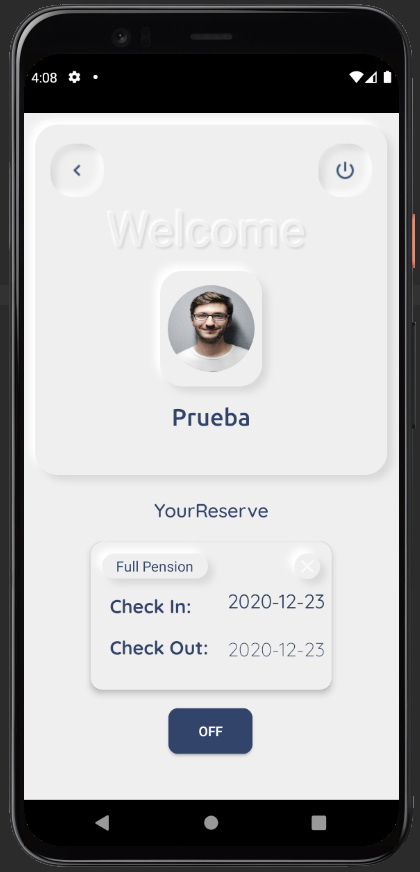
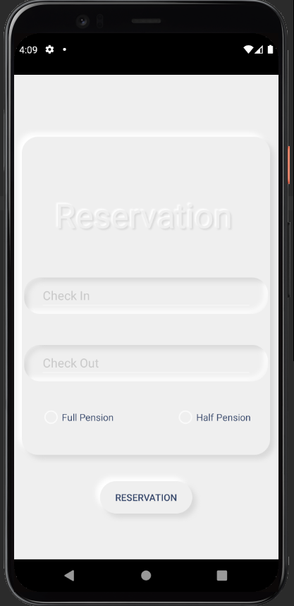
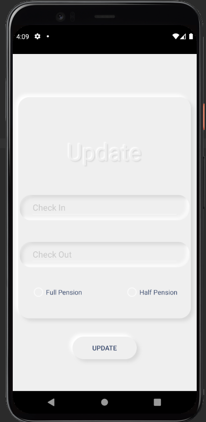

# Enlaza Proyect - Open Canarias
This project has been developed for the Open Canarias company, as it is already summarized in the name itself, the summarized idea of ​​the application is that a anyone can make a reservation for a hotel room.

 ## Table of Contents
1. [Pre Requisites](#pre-requisites)
2. [Data model](#data-model)
3. [Entity Relationship](#entity-relationship)
4. [Model Relationship](#model-relationship)
5. [User requirements](#user-requirements)
6. [Use cases](#use-cases)
7. [Enlaza Project Prototype](#enlaza-project-prototype)
8. [Technology Stack](#technology-stack)
9. [Repositories](#repositories)
10. [Planification](#planification)
11. [Conclusions and opinions](#conclusions-and-opinions)

## Pre Requisites
### First Steps 📋
When you download or clone this repository, the first thing you should do is run the following command in the direction of the project
```
composer install
```
### Migrations ⚙️
Then you must take into account the configuration of the DB in the .env file. Then you should create a migration with the following command:
```
php artisan migrate
```
You should also take into account other existing commands if you modify or eliminate something from the migrations:
```
php artisan migrate:rollback
php artisan migrate
```
And you are ready to start the Android app, but first you should be sure to open your command console and type the following command
```
ipconfig
```
Once you are clear about what IP your computer is using, you should go to the terminal and go to the backend folder, and then execute the following

```
php -S (YOUR_IP):8000 -t public
```
Now you should go to the IRetroFit file and ServiceSingleton to modify the ip previously established by me to yours

## Data model
The data model follows the following description or structure:
* **Users Table:** This table will be where we find the data to predispose to make the record.
  * **Name:** User name
  * **Email** User Email
  * **Password** User Password
  
* **Rooms Table:** This table will be where we find the data that the users of the rooms see.
  * **Number:** Room number
  * **Name:** Room name
  * **Subname:** Room number
  * **Description:** Room description
  * **Numperson:** Number of people who can occupy the room
  * **Size:** Room size
  * **Price:** Room price
  * **Starating:** Number of evaluations
  * **Url_img:** Room image
  
* **Bookings Table:** This table will be where we will find the data that you will have to give to develop the reservation.
  * **Check_in:** Check in
  * **Check_out** Check out
  * **Diet** Booking plan type
  
## Entity Relationship


## Model Relationship


## User requirements
Los requerimientos de usuario se puede definir lo siguiente:
* El usuario ha de poder registrarse mediante la autentificacion basica, ademas, de poder hacer Login.
* El usuario podra visualizar las habitaciones disponibles.
* El usuario ha de poder hacer reservas, una vez echas debera de poder visualizarlas, para luego poder eliminarlas o actualizarlas.


## Use cases


## Explanation of the Application
The application follows the architecture of the prototype provided as far as possible. That is, what is composed of the screens themselves:

* **Start Window:** In this window we can find a simple starting window of any application



* **Login or registration form:** In this window you will have to register, or in case you already have an account, simply enter your identifying information and enter.

* **Discover window:** In this window you must select between the different destinations to select.



* **User window:** In this window you will see data such as the name of the user and the reservations generated by the same.



* **Detail Room window:** You will see the specific room, in which you had played the last time.


* **Reserve or Update Reserve windows:** In these windows you will see a form where you can carry out the specific actions of each of the windows.



## Enlaza Project Prototype

I describe this section in its corresponding repository, https://github.com/JavierMedina11/Prototipo-ProyectoEnlaza

## Technology Stack
The technology stack is divided into the following technologies:

* **Backend:** PHP 7 / Laravel Framework
* **Microservicio:** Lumen Framework
* **BBDD:** MySQL
* **Frontend:** Android Kotlin

## Repositories

The repositories we find this same one and that of https://github.com/JavierMedina11/Prototerapia-ProyectoEnlaza

## Planification

The planning of the app, I have had to do it on the fly, that is, since I obtained the information from the company with such a delay, I have had to make an effort to try to do everything in a period of three or three and a half weeks.

## Conclusions and opinions

My final conclusion regarding the project is that it has not been easy, since when working with a technological stack in which I had no experience, especially, not so much the backend (Laravel & Lumen), but Android Studio based on Kotlin which is the one that made up the Frontend, it has not been a mild experience, especially when we get to the delivery date and in which the pressure increases even more, although, I would like to highlight that based on blows and despair, my Confidence in my abilities may have improved a bit, although, due to the short period of time at work, I have not been able to implement everything that I would like, which leaves me with a small feeling of discomfort and unease.


