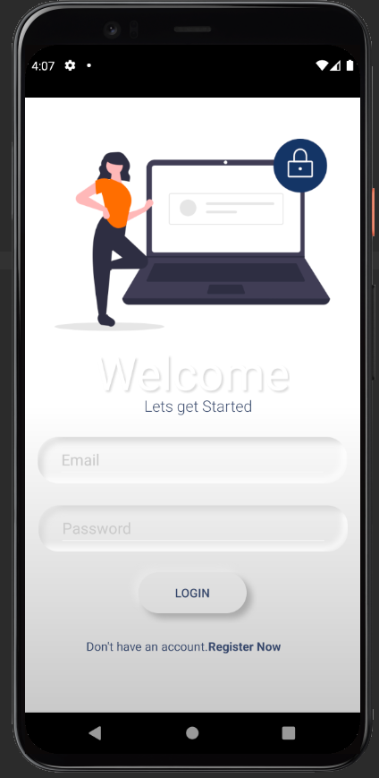
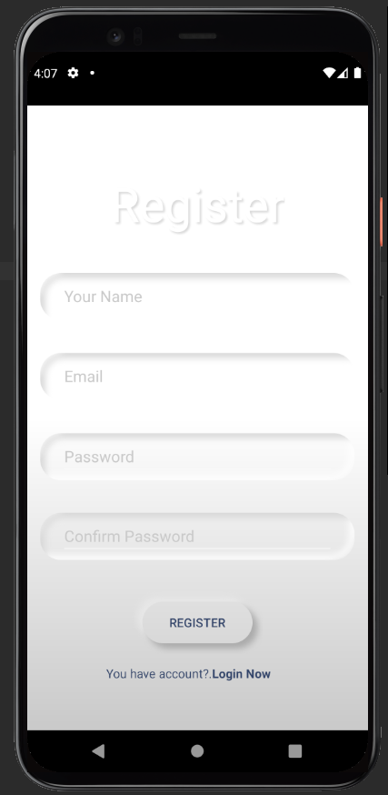
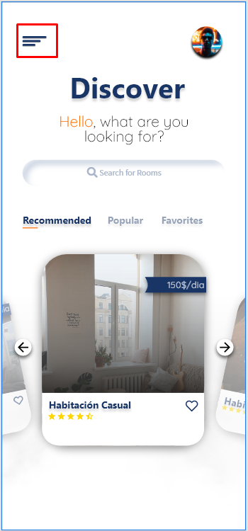
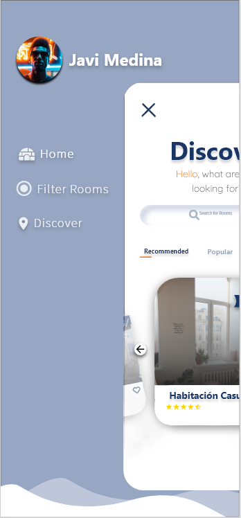
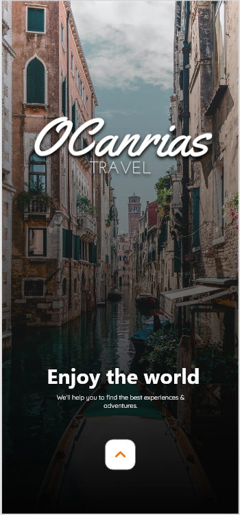
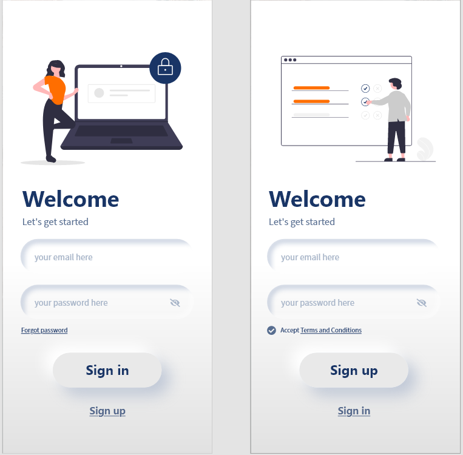
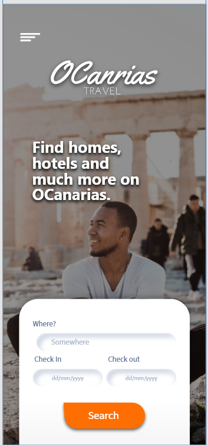
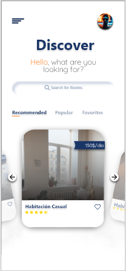
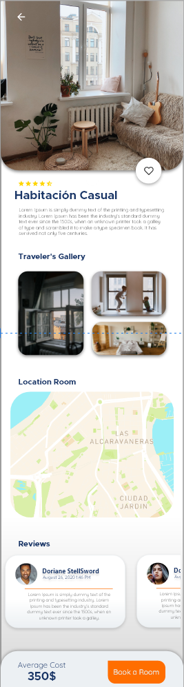
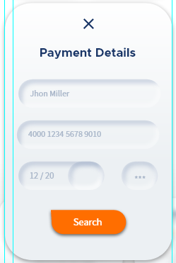

# Enlaza Proyect - Open Canarias
This project has been developed for the Open Canarias company, as it is already summarized in the name itself, the summarized idea of ​​the application is that a anyone can make a reservation for a hotel room.

 ## Table of Contents
1. [Data model](#data-model)
2. [Entity Relationship](#entity-relationship)
3. [Usability](#usability)
4. [Use cases](#use cases)
5. [Enlaza Project Prototype](#enlaza-project-prototype)
6. [Technology Stack](#technology-Stack)
7. [Repositories](#repositories)
8. [Planification](#planification)
9. [Conclusions and opinions](#conclusions-and-opinions)

## Data model
The data model follows the following description or structure:
* **Users Table:** This table will be where we find the data to predispose to make the record.
  * **Name:** User name
  * **Email** User Email
  * **Password** User Password
  
* **Rooms Table:** This table will be where we find the data that the users of the rooms see.
  * **Number:** Room number
  * **Name:** Room name
  * **Subname:** Room number
  * **Description:** Room description
  * **Numperson:** Number of people who can occupy the room
  * **Size:** Room size
  * **Price:** Room price
  * **Starating:** Number of evaluations
  * **Url_img:** Room image
  
* **Bookings Table:** This table will be where we will find the data that you will have to give to develop the reservation.
  * **Check_in:** Check in
  * **Check_out** Check out
  * **Diet** Booking plan type
  
## Entity Relationship

## Entity Relationship

## Use cases

## Explanation of the Application
The application follows the architecture of the prototype provided as far as possible. That is, what is composed of the screens themselves:

* **Start Window:** In this window we can find a simple starting window of any application

* **Login or registration form:** In this window you will have to register, or in case you already have an account, simply enter your identifying information and enter.

* **Discover window:** In this window you must select between the different destinations to select.

* **User window:** In this window you will see data such as the name of the user and the reservations generated by the same.

* **Detail Room window:** You will see the specific room, in which you had played the last time.

* **Reserve or Update Reserve windows:** In these windows you will see a form where you can carry out the specific actions of each of the windows.

## Prototipo Proyecto Enlaza

This will be the prototype or at least the initial idea of ​​how the application should be, once developed.

 In this documentation I will try to explain both the functionality of each of the windows, for this I will start by explaining the menu.
 
 ## Table of Contents
1. [Menu](#menu)
2. [Windows](#windows)
3. [Usability](#usability)

### MENU

The menu in this prototype is activated by clicking on the next marked area, once ejected the entire window is minimized, or at least its scale, to be able to see the menu in all its splendor, in this we can find a button that takes us home.

### WINDOWS

Among the windows that our interface is divided into, we can find the following:
* **Start Window:** In this window we can find a simple starting window of any application, when clicking on the button, you would give way to the form window.

* **Login or registration form:** In this window you will have to register, or in case you already have an account, simply enter your identifying information and enter.

* **Filter Window:** In this window you must put the filter data of the search, such as the departure and arrival date and the place.

* **Discover window:** In this window you must select between the different destinations to select.

* **Room Window:** In this window will be where you can see all the information about the room itself, data, such as a brief description, its location or a Review of other users. And if you click on the button at the end, you will go to the payment gateway.

### Usability

When we design multiplatform applications, the interface that we propose will be essential for the user to feel comfortable working with it. Bad design can cause customers to leave our application.

Within the context of computer applications and software development, usability is defined as the discipline that studies how to design websites and applications so that users can interact with them in the easiest, most comfortable and most intuitive way possible.

Among the elements that I have taken into account when trying to create a design as legible as possible and that does not provide any kind of difficulty or deficiency when interpreting its content, they have been:

* **Colors:** Among the colors that I have used in this design we find:
  * **#193566:** Choose to use this color as it is one that was already present on your website.
  * **#FF6E00:** This is another one that is present on your website.
  * **#FFFFFF:** This is another one that is present on your website.
  * **#E9E9E9:** White Drift.
  * **#000000:** It is the black of all life.
  * **#97A7C3:** I selected it for being a color that would be derived from # 193566 (Navy Blue).
  * **#ECF0F3:** I select it because it is a color that would be derived from # 193566 (Navy Blue).
  
* **Use of Colors:** The use that I gave to each of the colors were the following:
  * **#193566:** I have used this color mainly for the use of small details, such as some buttons, or in case you want to highlight small elements or icons.
  * **#FF6E00:** I have used it for the subject of titles, subtitles and some other elements in which I used it to create contrast. 
  * **#FFFFFF & # E9E9E9:** I use them mainly to create a gradient in the background of many of the windows of my interface or prototype.
  * **#000000:** I use it to create a little contrast between the text in that window, when the background is starring an image.
  * **#97A7C3 & # ECF0F3:** I use them for the menu background or for some details to contrast with the Navy Blue (# 193566).
  * **#ECF0F3:** I select it because it is a color that would be derived from # 193566 (Navy Blue).
  
* **Typography:** The fonts I have used are:
  * **Product Sans:** I use it for the titles of most items.
  * **Source Sans Pro:** I use it for the subtitles of most elements.
  * **Quicksand:** I use this typeface mainly for the description inside the rooms or for elements such as reviews. Also, he used different weights within it from "Light", "Regular" and "Medium".
  
  * **Interactive elements:** In the prototype you will find the buttons as interactive elements, in each of the majority of windows, in some, they will be a button to complete the room search, in others they will be arrows to move between elements of a slideshow, or in another to display the menu.

* **Data presentation:** In this case, when talking about the presentation of data, I think I should emphasize precisely the last window, which is where I specify information about the rooms, there what I do is precisely divide the content into different sections, from the location of said room, a brief description, the reviews of other users or a section to complete the download.

### Technology Stack
The technology stack is divided into the following technologies:

* **Backend:** PHP 7 / Laravel Framework
* **Microservicio:** Lumen Framework
* **BBDD:** MySQL
* **Frontend:** Android Kotlin

### Repositories

The repositories we find this same one and that of https://github.com/JavierMedina11/Prototerapia-ProyectoEnlaza

### Planificacion

The planning of the app, I have had to do it on the fly, that is, since I obtained the information from the company with such a delay, I have had to make an effort to try to do everything in a period of three or three and a half weeks.

### Conclusions and opinions

My final conclusion regarding the project is that it has not been easy, since when working with a technological stack in which I had no experience, especially, not so much the backend (Laravel & Lumen), but Android Studio based on Kotlin which is the one that made up the Frontend, it has not been a mild experience, especially when we get to the delivery date and in which the pressure increases even more, although, I would like to highlight that based on blows and despair, my Confidence in my abilities may have improved a bit, although, due to the short period of time at work, I have not been able to implement everything that I would like, which leaves me with a small feeling of discomfort and unease.

